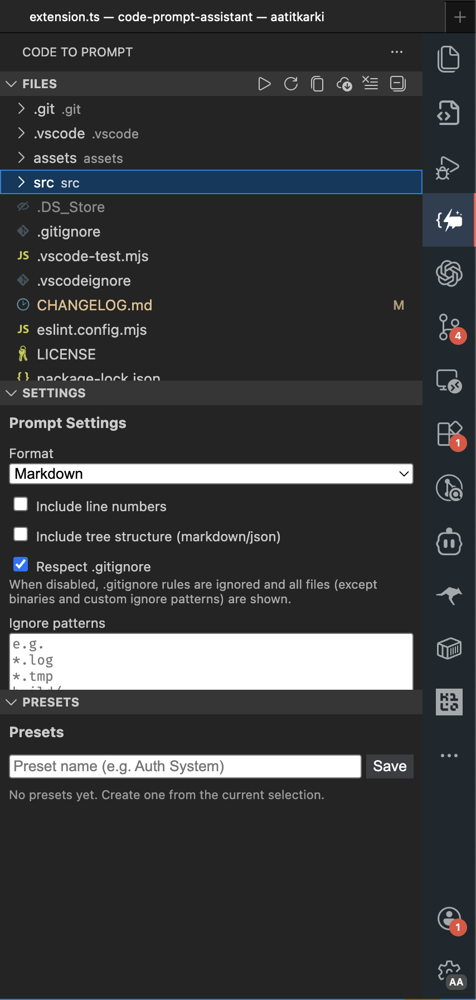
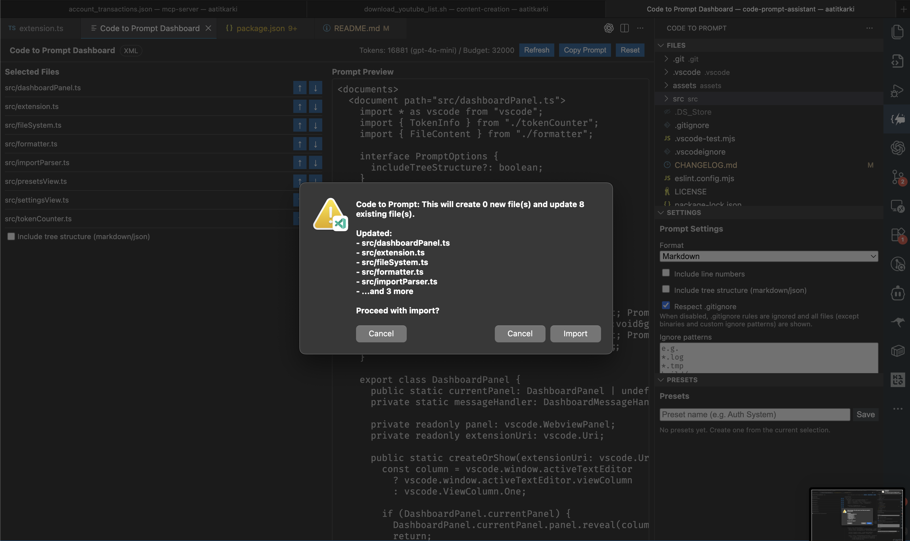

# Code to Prompt

<p align="center">
  
  <br />
  <strong>Turn your codebase into LLM-ready context in one click.</strong>
</p>

Transform your project into clean, structured prompts for ChatGPT, Claude, Copilot, DeepSeek and more — directly from VS Code.

---

## 🎬 Quick look

> Replace these with your real images / GIFs once you capture them.

<p align="center">
  <!-- Short looping GIF showing: select files → open dashboard → copy -->
  
</p>

---

## ✨ What it does

**Code to Prompt** lets you:

- Browse your workspace in a dedicated **Files** view
- Select exactly the files/folders you want (no `node_modules`, no binaries, no `.env` by mistake)
- See **live token estimates** for the whole prompt
- Format everything into one structured block (Markdown, XML, or JSON)
- Copy the result with **one click** — from the sidebar or from a full-screen dashboard
- (Optional) Let the AI **edit your code and generate new files**, then safely import them back into your workspace

All processing happens locally in VS Code. Nothing is sent anywhere by this extension.

## 📁 Files sidebar

<p align="center">
  
</p>

**Files** view (Activity Bar icon):

- Interactive **tree view** of your workspace
- Click files/folders to **select / deselect** them
- Folder clicks select/unselect all eligible files inside
- **Select Open Editors** command to grab all visible editors
- **Title bar actions:**
  - ▶️ **Open Dashboard**
  - 🔄 **Reload Files**
  - 📋 **Copy Prompt** (fast path, no dashboard)
  - ⬇️ **Import from Clipboard** (apply AI-generated changes)
  - 🧹 **Reset Selection**

## 🧠 Smart, noise-free selection

- **Respects `.gitignore`** by default so you don’t accidentally include:
  - `node_modules/`
  - build output (`dist/`, `out/`…)
  - other ignored junk
- Additional **ignore patterns** (e.g. `*.log`, `dist/`, `*.tmp`) configurable in **Settings**
- Built-in **binary guard** automatically skips:
  - images, PDFs, archives, lock files, executables, etc.

## 🧩 Multiple prompt formats

Choose the format that matches your LLM:

- **Markdown** (default)
  - `File: src/main.ts` header
  - Language-tagged fenced code blocks
  - Optional **project tree summary** at the top
- **XML**
  - `<documents>` root with `<document path="...">` entries
  - Ideal for “tools / schema” style prompts
- **JSON**
  - `{ "documents": [ { path, content } ], "tree": "..." }`
  - Great for API calls or custom tooling

You can switch format any time in the **Settings** view.

---

## 📊 Token-aware prompts

- **Live token count** for the full prompt
- Uses `tiktoken` when available, with a **fallback heuristic** if not
- Configurable **token budget** (e.g. 8k, 32k, 128k)
- Warnings when the prompt goes over budget
- Token info is visible in:
  - The **Dashboard**
  - Notification messages after copy

## 🧱 Dashboard view

<p align="center">
  
</p>

Open the **Dashboard** via:

- ▶️ icon in the Files view, or
- Command Palette: **“Code to Prompt: Open Dashboard”**

Dashboard gives you:

- **Selected files list**
  - Shows paths in the exact order they’ll appear in the prompt
  - Reorder via **↑ / ↓** buttons
- **Prompt Preview**
  - Inspect the generated prompt before copying
  - Uses current format (Markdown/XML/JSON) + your header/footer prompts
- **Controls**
  - **Include tree structure** toggle (for Markdown / JSON)
  - **Token count & budget** indicator
  - **Copy Prompt**
  - **Reset** (clears selection and refreshes)

## 💾 Presets

<p align="center">
  
</p>

Save and reuse your favorite selections:

- Create named **presets** (e.g. `Auth system`, `DB schema`, `API handlers`)
- Presets remember the list + order of selected paths
- Load a preset to instantly restore the same selection
- Delete presets you no longer need

All managed from the **Presets** view in the sidebar.

## ⚙️ Settings & header/footer prompts

<p align="center">
  
</p>

The **Settings** view lets you tune how prompts are generated:

- **Format**: `markdown` / `xml` / `json`
- **Include line numbers**: prepend `1:`, `2:`… in code blocks
- **Include tree structure**: add a text tree of selected files/folders
- **Respect `.gitignore`**: toggle to show/hide ignored files
- **Ignore patterns**: extra `.gitignore`-style globs (one per line)
- **Token budget**: numeric limit used for warnings

### Header / footer prompt text

You can also define:

- **Header prompt** — prepended above the generated documents, e.g.:

  > `This is my current code. Help me fix performance issues in the data layer.`

- **Footer prompt** — appended below the documents, e.g.:

  > `Always output in the same format I have provided.`

- Optional **standard footer note**:

  > `Always output in same format as provided. Only provide new or files that require update.`

These help you “lock in” how the AI responds, especially when using the **Import** feature.

## 📥 Importing AI-generated changes

You can round-trip between your code and the model:

1. **Generate a prompt** with Code to Prompt (Markdown / XML / JSON).
2. Ask your model to **edit code or create new files**, and instruct it to respond in the same format.
3. Copy the model’s response.
4. Run **“Code to Prompt: Import Prompt from Clipboard”** or click the ⬇️ icon in the Files view.

The extension will:

- Auto-detect whether the response is **Markdown**, **XML**, or **JSON**
- Parse each document entry (`path` + `content`)
- Compare with your workspace to figure out:
  - **New files** (will be created)
  - **Existing files** (will be overwritten)

### Import confirmation dialog

If **Require import confirmation** is enabled in Settings:

- A summary dialog will show:
  - Number of **new** files + their paths
  - Number of **updated** files + their paths
- You can **Confirm** or **Cancel** the import

<p align="center">
  
</p>

This gives you a safety net against accidental massive refactors.

## 🧑‍💻 Usage – quick guide

1. **Open the sidebar**

   - Click the **Code to Prompt** icon in the Activity Bar
   - You’ll see **Files**, **Settings**, and **Presets** views

2. **Select files**

   - Expand folders in **Files**
   - Click to toggle files/folders
   - Use **Select Open Editors** to add all currently visible files
   - Use **Reset** to clear selection

3. **Generate a prompt**

   - For a fast copy:
     - Click **📋 Copy Prompt** in the Files view title bar
   - For full control:
     - Click **▶️ Open Dashboard**
     - Reorder files, tweak settings, then **Copy Prompt**

4. **Use with your LLM**

   - Paste the prompt into ChatGPT / Claude / Copilot / DeepSeek
   - Customize the header/footer prompts to guide the model

5. **Import changes back (optional)**
   - Copy the model’s response (same format)
   - Run **Import Prompt from Clipboard**
   - Review the confirmation dialog and confirm to write files

---

## 🔧 Configuration

You can manage all settings via:

- The **Settings** view in the sidebar, or
- VS Code Settings (`Ctrl+,` / `Cmd+,`) → search for **“Code to Prompt”**

Key settings:

| Setting                                  | Type    | Default      | Description                                                                                  |
| ---------------------------------------- | ------- | ------------ | -------------------------------------------------------------------------------------------- |
| `codeToPrompt.defaultFormat`             | string  | `"markdown"` | Output format: `markdown`, `xml`, or `json`.                                                 |
| `codeToPrompt.includeLineNumbers`        | boolean | `false`      | Add line numbers to each code block.                                                         |
| `codeToPrompt.includeTreeStructure`      | boolean | `false`      | Include a text tree of the selected files/folders.                                           |
| `codeToPrompt.respectGitignore`          | boolean | `true`       | Respect `.gitignore` rules when building the Files tree.                                     |
| `codeToPrompt.ignorePatterns`            | string  | `""`         | Extra ignore patterns (one per line, `.gitignore`-style).                                    |
| `codeToPrompt.tokenBudget`               | number  | `32000`      | Token budget used for warnings.                                                              |
| `codeToPrompt.headerPrompt`              | string  | `""`         | Optional header instructions to prepend to every prompt.                                     |
| `codeToPrompt.footerPrompt`              | string  | `""`         | Optional footer instructions to append to every prompt.                                      |
| `codeToPrompt.appendStandardFooterNote`  | boolean | `true`       | Append the standard “same format / only changed files” note to the footer.                   |
| `codeToPrompt.requireImportConfirmation` | boolean | `true`       | Show a confirmation summary (new/updated files) before writing any imported changes to disk. |

---

## ⌨️ Commands

Available from the Command Palette (`Ctrl+Shift+P` / `Cmd+Shift+P`):

- **Code to Prompt: Open Dashboard**
- **Code to Prompt: Copy Prompt**
- **Code to Prompt: Select Open Editors**
- **Code to Prompt: Reset Selection**
- **Code to Prompt: Reload Files**
- **Code to Prompt: Import Prompt from Clipboard**

---

## 📥 Installation

1. Open **Visual Studio Code**
2. Go to **Extensions** (`Ctrl+Shift+X` / `Cmd+Shift+X`)
3. Search for **“Code to Prompt”**
4. Click **Install**

Or install a local `.vsix`:

```bash
code --install-extension code-to-prompt-x.y.z.vsix
```

## 🔐 Privacy & Security

- All processing happens **locally** inside VS Code
- Your code is **never** sent to external servers by this extension
- Use `.gitignore` and **ignore patterns** to avoid including secrets (e.g. `.env`, keys) in your prompts

## 🤝 Contributing

Bugs, ideas, feature requests — all welcome!

1. Open an issue or discussion on
   [GitHub](https://github.com/aatitkarki/code-to-prompt)
2. Fork the repo
3. Create a feature branch
4. Submit a pull request

## 📄 License

This extension is licensed under the [MIT License](LICENSE).
